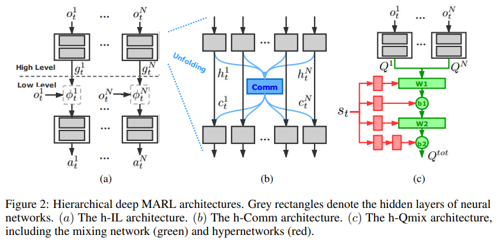
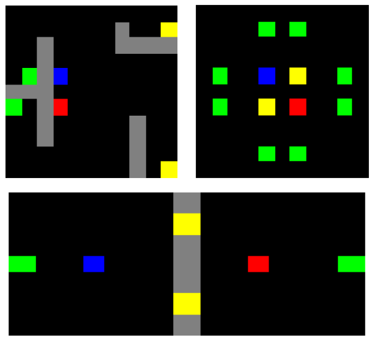
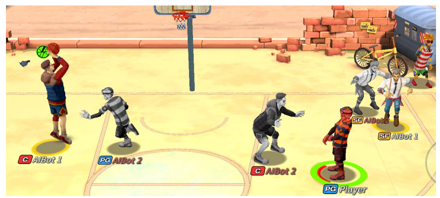
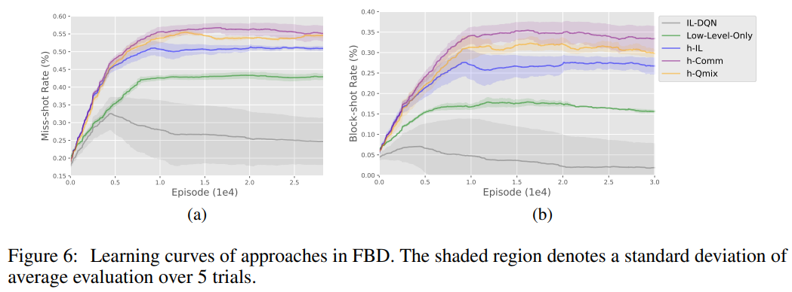

# Hierarchical Deep Multiagent Reinforcement Learning with Temporal Abstraction (HD-MARL)

This is the official implementation (a neat version) of 
our work [Hierarchical Deep Multiagent Reinforcement Learning with Temporal Abstraction](https://arxiv.org/abs/2010.09536).

## Introduction

Multiagent reinforcement learning (MARL) is commonly considered to suffer from non-stationary environments and exponentially increasing policy space. 
It would be even more challenging when rewards are sparse and delayed over long trajectories. 
In this work, we study hierarchical deep MARL in cooperative multiagent problems with sparse and delayed reward.
With temporal abstraction, we decompose the problem into a hierarchy of different time scales and investigate how agents can learn high-level coordination 
based on the independent skills learned at the low level. 

**Three hierarchical deep MARL architectures** are proposed to learn hierarchical policies under different MARL paradigms.
- **Hierarchical Independent Learner (h-IL)**: a straighforward extention of Independent Learning (IL) (i.e., Decentralized Learning and Decentralized Execution) with temporal abstraction;
- **Hierarchical Communication Network (h-Comm)**: a hierarchical architecture with a temporally abstract variant of [CommNet](https://proceedings.neurips.cc/paper/2016/hash/55b1927fdafef39c48e5b73b5d61ea60-Abstract.html) (i.e., Centralized Training and Centralized Execution) implemented for high-level learning;
- **Hierarchical Qmix Network (h-Qmix)**: a hierarchical architecture with a temporally abstract variant of [Qmix](http://proceedings.mlr.press/v80/rashid18a.html) (i.e., Centralized Training and Decentralized Execution) implemented for high-level learning.

The key idea of h-Comm and h-Qmix is to learn cooperative strategies in the high level of hierarchy with a coarser/larger temporal grain, and leave the relatively independent behavior learning to the low level which performs at finer temporal grain.
Illustrations of the architectures are shown below:
<div align=center></div>

Besides, we propose **a new experience replay mechanism** to alleviate the issue of the sparse transitions at the high level of abstraction and the non-stationarity of multiagent learning. 

We empirically demonstrate the effectiveness of our approaches in two domains with extremely sparse feedback: 
(1) a variety of **Multiagent Trash Collection (MATC)** tasks, and (2) a challenging online mobile game, i.e., **Fever Basketball Defense (FBD)**.


## Repo Content
The source code mainly contains:  
-  algs: contains the implementation of h-IL used in MATC experiments (also in FBD experiments);
-  algs_fbd: contains the implementation of h-Comm and h-Qmix used in FBD experiments;
-  envs: contains the implmentation of MATC envs;
-  exps: contains the training scripts of hierarchical deep MARL agents in MATC.  

All the implementation and experimental details mentioned in our paper and the Supplementary Material can be found in our codes.  

## Installation

Our codes are implemented with **Python 3.6** and **Tensorflow 1.8**.
We recommend the user to install **anaconada** and or **venv** for convenient management of different python envs.

### Environment Setup

For MATC, we provide the source codes of environments used in our paper in the folder **envs**. One can directly import and initial the envs conveniently.

<div align=center></div>

For FBD, our run our experiments on an inner version of _Fever Basketball_ provided by Fuxi AI Lab, NetEase when the first author of this work was an intern there (in 2018).
To our knowledge, _Fever Basketball_ is now opensource by Fuxi AI Lab at https://github.com/FuxiRL/FeverBasketball. 
We do not check the difference of the opensource version and the ancient inner version we used in our work.
Given clear introduction of API, we believe it is easy to rebuild the experiments with the implmentations of h-Comm and h-Qmix we provided in **algs_fbd**.

<div align=center></div>

Please refer to our paper for detailed introduction of MATC and FBD environments.

## Examples  


### Training Scripts

Examples of training scripts in MATC are provided in the folder **exps**:
> python ./exps/2a2d2t_room/MATC_IL.py

For hyperparameter settings, please refer to our paper for details. Feel free to modify on needs.

### Experiment Results

For MATC, we compare the h-IL architecture with independent DQN (IL-DQN), which can be viewed as a non-hierarchical version of h-IL. 
The results are shown in Figure (b)-(d) below. 
In all three tasks, IL-DQN can hardly achieve any positive reward, while h-IL successfully accomplishes the tasks and achieves near-optimal performance especially in MATC-Room and MATC-Coordination. 
This indicates that it is difficult to learn coordinated behaviors over primitive actions with such sparse reward.

<div align=center></div>

For FBD, first, the significance of temporal abstraction can be demonstrated by h-IL’s superior performance over IL-DQN. 
Besides, Low-Level-Only also shows certain defense performance even with a random high-level policy.
Furthermore, h-Comm and h-Qmix achieve comparative results and both of them clearly outperform the base architecture h-IL. 

Interestingly, we observe that h-Comm and h-Qmix show different defense tactics. h-Comm prefers
joint defense and rapid shifts, while h-Qmix tends to one-to-one defense. This explains the results
of h-Comm and h-Qmix in Figure 6. Joint defense strategy are more aggressive thus results in a
higher block-shot rate, while may leave some offense player unguarded. One-to-one defense ensures
good defense quality and leads to a comparative miss-shot rate in spite of a lower block rate.

<div align=center></div>

## Citation
If this repository has helped your research, please cite the following:
```
@inproceedings{Tang2021HDRMARL,
  author    = {Hongyao Tang and
               Jianye Hao and
               Tangjie Lv and
               Yingfeng Chen and
               Zongzhang Zhang and
               Hangtian Jia and
               Chunxu Ren and
               Yan Zheng and
               Changjie Fan and
               Li Wang},
  title     = {Hierarchical Deep Multiagent Reinforcement Learning},
  journal   = {arXiv preprint},
  volume    = {abs/1809.09332},
  year      = {2018},
  url       = {http://arxiv.org/abs/1809.09332},
}