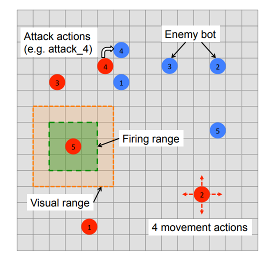
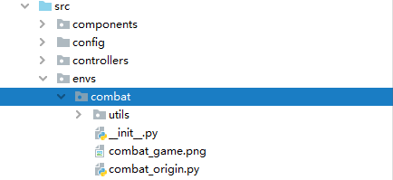
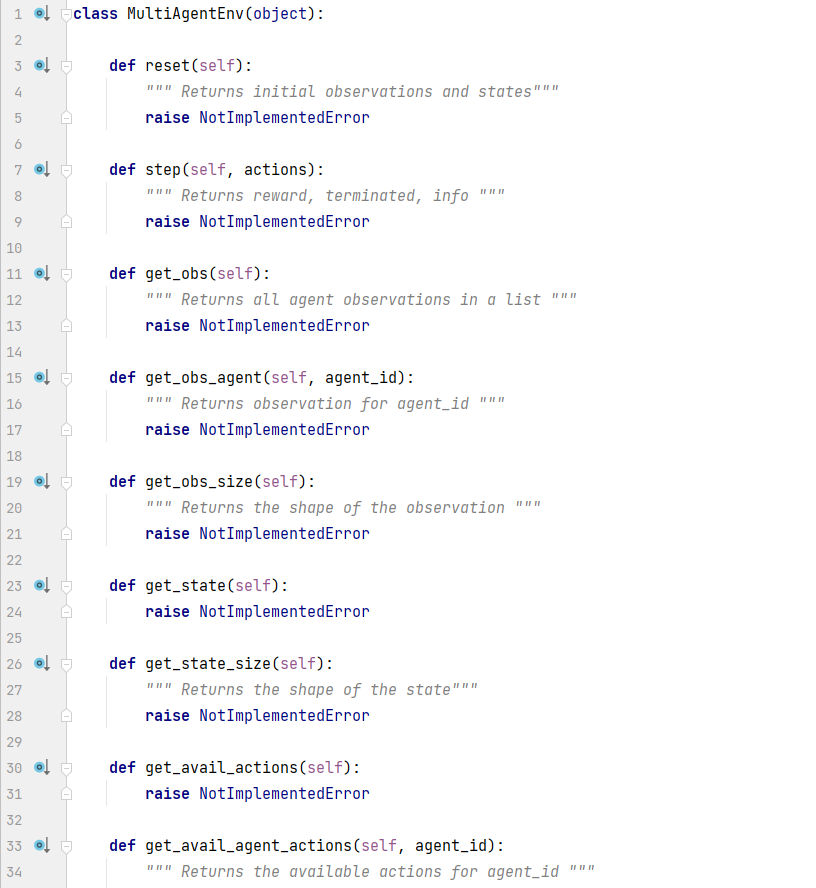
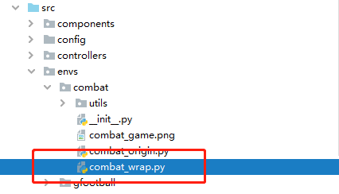
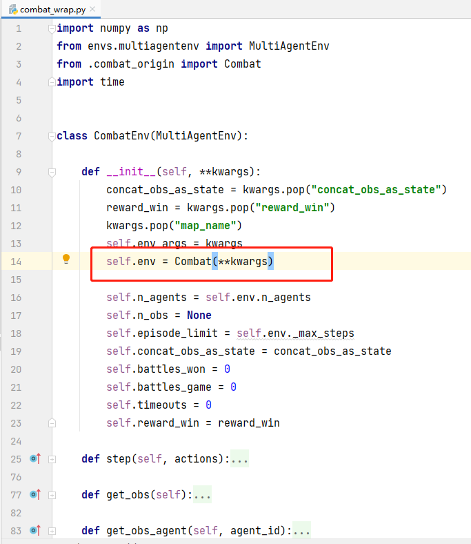
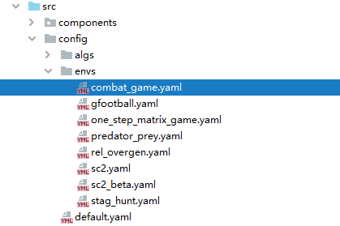
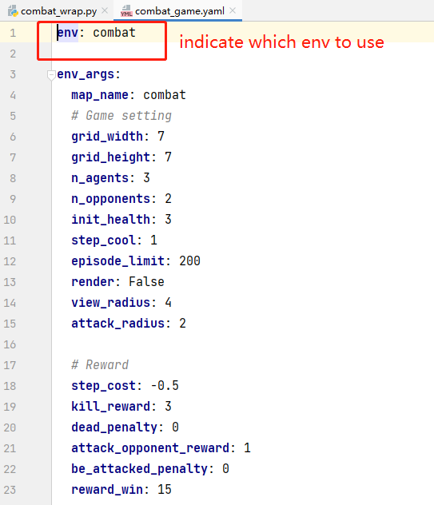
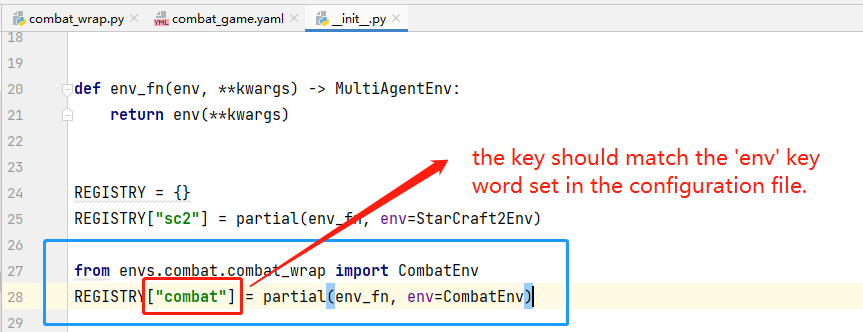

# The curse of dimensionality (scalability) issue

In MARL, the joint state-action space grows exponentially as the number of agents increases. This is also referred to as the combinatorial nature of MARL. Thus, MARL algorithms typically suffer from **poor sample-efficiency** and **poor scalability** due to the exponential grows of the dimensionality. The key to solve this problem is to reduce the size of the state-action space properly. 

| Category        | Sub-Categories                                               | Research Work (Conference)                                   | Progress           |
| :-------------- | :----------------------------------------------------------- | :----------------------------------------------------------- | ------------------ |
| **scalability** | **scalable multiagent network**     (1) permutation invariant (equivariant)        (2) action semantics     (3) Game abstraction      (4) dynamic agent-number network   | (1) [API (underreview) [1]](https://arxiv.org/pdf/2203.05285.pdf)  (2) [ASN (ICLR-2020) [2]](https://openreview.net/forum?id=ryg48p4tPH) (3) [G2ANet (AAAI-2020) [3]](https://ojs.aaai.org/index.php/AAAI/article/view/6211)  (4) [DyAN (AAAI-2020) [4]](https://ojs.aaai.org/index.php/AAAI/article/view/6221)  | :white_check_mark: |

## How to use this repository？

### 1. How to add a new environment?

We give an example for add the Combat-v0 task of [ma-gym](https://github.com/koulanurag/ma-gym) into our repository. 

- **Step-1:** create a new folder in the `src/envs` directory and put the original environment code here.
  - 
- **Step-2:** according to the programming interface defined in `src/envs/multiagentenv.py`, add a environmental wrapper to the original environment to implement the core functions that defined in `multiagentenv.py`.
  - implement your code according to the programming interface: 
  - add your environmental wrapper:
    - 
    - implement your own wrapper. 

- **Step-3:** add your environmental configuration into the folder `src/config/envs`.
  - 
  - implement your configuration file.  Notice that **the most important key word** is the `env`, which indicates which environment will be loaded.
    - 
- **Step-4 (final step):** registering your new environment.
  - 

### 2. add a new algorithm

## Publication List

[1] Hao X, Wang W, Mao H, et al. API: Boosting Multi-Agent Reinforcement Learning via Agent-Permutation-Invariant Networks[J]. arXiv preprint arXiv:2203.05285, 2022.

[2] Wang W, Yang T, Liu Y, et al. Action Semantics Network: Considering the Effects of Actions in Multiagent Systems[C]//International Conference on Learning Representations. 2019.

[3] Liu Y, Wang W, Hu Y, et al. Multi-agent game abstraction via graph attention neural network[C]//Proceedings of the AAAI Conference on Artificial Intelligence. 2020, 34(05): 7211-7218.

[4] Wang W, Yang T, Liu Y, et al. From few to more: Large-scale dynamic multiagent curriculum learning[C]//Proceedings of the AAAI Conference on Artificial Intelligence. 2020, 34(05): 7293-7300.
